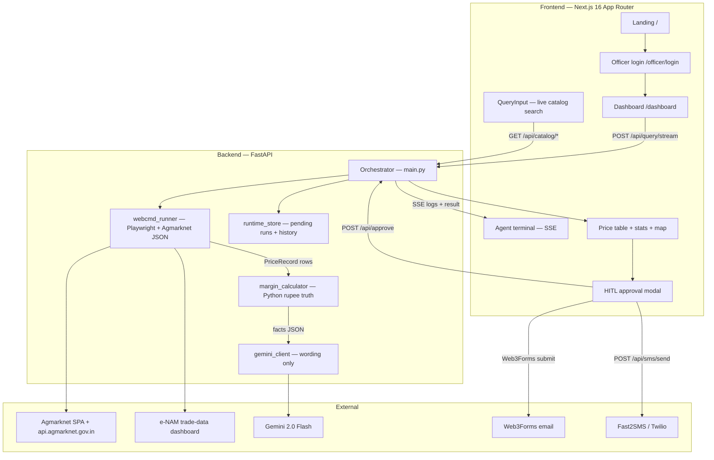
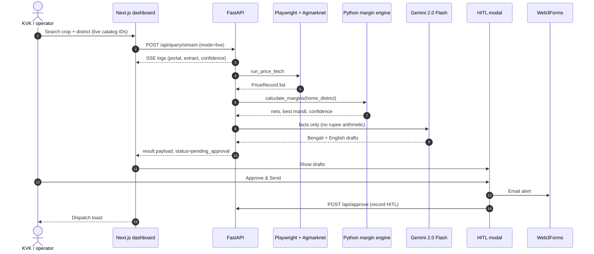

# KrishiDrishti AI — Autonomous Agri-Arbitrage Agent

[](https://nextjs.org/)
[](https://fastapi.tiangolo.com/)
[](https://playwright.dev/)
[](https://ai.google.dev/)
[](https://tailwindcss.com/)
[](https://www.python.org/)

> **SLAB Hackathon & AgentForge 2026 @ GCELT, Kolkata**
>
> Real-time agricultural price discovery for smallholder farmers: live Agmarknet catalogs, logistics-adjusted net margins in Python, bilingual (বাংলা / English) wording via Gemini, and a non-negotiable Human-in-the-Loop gate before any alert leaves the dashboard.

The product name in the UI is **KrishiDrishti AI**. The repository and many Python modules still use **MandiPulse** / **MundiPulse**.

---

## Table of contents

- [Problem](#problem)
- [What the system does](#what-the-system-does)
- [Architecture](#architecture)
- [Pipeline](#pipeline)
- [Tech stack](#tech-stack)
- [Project structure](#project-structure)
- [Getting started](#getting-started)
- [Environment variables](#environment-variables)
- [API reference](#api-reference)
- [Data, portals, and selectors](#data-portals-and-selectors)
- [Responsible AI](#responsible-ai)
- [Tests](#tests)
- [Roadmap](#roadmap)

---

## Problem

Smallholder farmers in districts such as Hooghly, Purba Bardhaman, and Nadia often sell below a fair net price because official portals are hard to use on poor connectivity, and a high mandi quote is not the same as profit after freight.

KrishiDrishti closes that gap by:

1. **Discovering prices** from government sources (Agmarknet live JSON; e-NAM attempted via a guarded browser path).
2. **Computing net ₹/quintal in Python** (distance × vehicle band × freight), never in the LLM.
3. **Drafting bilingual alerts** (Bengali + English) from those facts.
4. **Blocking dispatch** until an operator approves in the glassmorphic HITL modal.

---

## What the system does

| Surface | Behaviour |
|---|---|
| **Landing (`/`)** | Public. “Launch Dashboard” goes to officer login. |
| **Officer login** | `/officer/login` sits between landing and dashboard. Register is name + email + password + free-text address (no Agmarknet catalog pick). |
| **Dashboard (`/dashboard`)** | After login: live crop/district search, SSE terminal, prices, map, farmer registry, HITL email + SMS. Unauthenticated visits redirect to login. |
| **Live vs demo** | Default query mode is `live`. If live returns no rows **and** the officer did not pick catalog IDs, the runner falls back to labelled **DEMO** seed prices. Catalog searches with IDs that return zero rows stay live (no silent demo swap). |
| **Margins** | Haversine distance from home district centroids / mandi master, `transport_rates.json` bands, net = modal − freight. |
| **Gemini 2.0 Flash** | Explanation and translation only. Money fields are overwritten from Python before the UI/SMS copy is stored. If Gemini is down, a Python template draft is used with the same numbers. |
| **HITL email** | Unchanged: Web3Forms from the dashboard after **Authorize & Dispatch Email**, then `POST /api/approve`. |
| **HITL SMS** | In-app compose (not the device `sms:` app). Send via Fast2SMS or Twilio if keys are set; otherwise a clear 503. Email still works. |

---

## Architecture



**Money vs language (hard split)**

```
live / demo prices  →  Python nets, confidence, flags  →  Gemini wording  →  HITL  →  email and/or SMS
                         (source of truth)                 (copy only)
```

---

## Pipeline



---

## Tech stack

| Layer | Technology | Role |
|---|---|---|
| UI | Next.js 16 (App Router), React 19 | Landing + dashboard |
| Style / motion | Tailwind CSS v4, Framer Motion, Lucide | Dark agri-tech theme, cursor, loaders |
| API | FastAPI, Pydantic v2, Uvicorn | SSE, catalogs, HITL, history |
| Browser | Playwright (in-process) | Guarded portal open; module still named `webcmd_runner` for PRD compatibility |
| Prices | Agmarknet `dashboard-filters` / `dashboard-data` JSON | Live district-level averages; not a named yard table |
| Geo / freight | `mandi_master.json`, `district_centroids.json`, `transport_rates.json` | Distance and ₹/km/quintal bands |
| LLM | `google-genai`, model `gemini-2.0-flash` | Localize and explain Python facts |
| Alerts | Web3Forms (dashboard) + Fast2SMS/Twilio | Email after HITL; SMS compose uses Fast2SMS or Twilio when configured |
| Tests | pytest, pytest-asyncio, httpx ASGI | API, margins, runner, Gemini fallback, SMS helpers |

There is **no** `@agentrhq/webcmd` dependency. Cached paths under `backend/agent/cache/` are hints only; they are not trusted command scripts.

---

## Project structure

```
MundiPulse AI/
├── README.md
├── MandiPulse_AI_PRD_FINAL.md          # Product requirements
├── requirements.txt
├── pytest.ini
├── .env.example
├── config/
│   └── portal_config.json              # e-NAM / Agmarknet / optional WB APMC
├── backend/
│   ├── main.py                         # FastAPI app and routes
│   ├── config.py                       # Pydantic Settings (.env)
│   ├── models/price_record.py          # PriceRecord, QueryRequest, HITL
│   ├── agent/
│   │   ├── webcmd_runner.py            # Live/demo fetch orchestration
│   │   ├── agmarknet_live.py           # Official Agmarknet JSON + search
│   │   ├── browser_guard.py            # Fail-safe DOM / identity checks
│   │   ├── selectors/                  # Placeholder CSS (see docs/SELECTORS.md)
│   │   └── cache/                      # Navigation hints (not trusted)
│   ├── llm/
│   │   ├── gemini_client.py
│   │   └── prompts/explain_and_localize.txt
│   └── services/
│       ├── margin_calculator.py        # Only source of rupee figures
│       ├── geocoder.py
│       ├── runtime_store.py            # Pending runs + history
│       ├── recipients_store.py
│       ├── officers_store.py
│       ├── officer_auth.py             # JWT + password hash (officer registry)
│       ├── sms_dispatcher.py           # Web3Forms email helper + Fast2SMS/Twilio SMS
│       ├── sms_inbox.py
│       ├── mock_agent.py               # Demo-path helpers
│       └── mock_gemini.py
├── frontend/
│   ├── app/
│   │   ├── page.tsx                    # Landing
│   │   ├── dashboard/page.tsx          # Operator console
│   │   ├── officer/login + register    # Officer JWT session
│   │   ├── layout.tsx                  # Inter, Outfit, JetBrains Mono
│   │   ├── globals.css
│   │   └── components/                 # Query, terminal, table, map, HITL, …
│   └── package.json
├── data/
│   ├── mandi_master.json
│   ├── transport_rates.json
│   ├── district_centroids.json
│   └── demo_prices.json                # Labelled DEMO snapshot
├── docs/
│   └── SELECTORS.md                    # How to verify portal CSS
└── tests/                              # pytest suite (isolated runtime store)
```

---

## Getting started

### Prerequisites

- **Node.js** 18.18+ or 20+
- **Python** 3.11+
- **npm**
- Chromium for Playwright (installed in the backend step)

### 1. Backend (FastAPI)

From the repository root:

```bash
python -m venv venv
# Windows
.\venv\Scripts\activate
# macOS / Linux
source venv/bin/activate

pip install -r requirements.txt
python -m playwright install chromium

copy .env.example .env   # Windows
# cp .env.example .env   # macOS / Linux
```

Set at least `GEMINI_API_KEY` in `.env` for live wording. Without it, the pipeline still returns Python-template Bengali/English drafts.

Start the API **from the `backend` directory** so `main:app` resolves:

```bash
cd backend
python -m uvicorn main:app --reload --host 0.0.0.0 --port 8000
```

- API: [http://localhost:8000](http://localhost:8000)
- OpenAPI: [http://localhost:8000/docs](http://localhost:8000/docs)
- Health: `GET /api/health`

### 2. Frontend (Next.js)

```bash
cd frontend
npm install
npm run dev
```

Landing: [http://localhost:3000](http://localhost:3000) — Launch Dashboard opens officer login. After login: [http://localhost:3000/dashboard](http://localhost:3000/dashboard).

The UI calls `http://localhost:8000` unless you set `NEXT_PUBLIC_API_URL`. Put that in `frontend/.env.local` if the API is not on port 8000.

Live catalog search needs the backend up and Agmarknet reachable. If the catalog APIs fail, QueryInput shows an error — it does not use a hardcoded crop list.

---

## Environment variables

Root `.env` (loaded by `backend/config.py`):

| Variable | Required | Purpose |
|---|---|---|
| `GEMINI_API_KEY` | For Gemini copy | Wording/translation only |
| `WEB3FORMS_ACCESS_KEY` | For backend email helper | Same provider as the dashboard approve path |
| `TWILIO_*` / `FAST2SMS_API_KEY` | For SMS send | Fast2SMS preferred; else Twilio. HITL + officer JWT required. Email still works if SMS keys are missing |
| `MANDIPULSE_PORTAL_CONFIG` | No | Override path to `portal_config.json` |
| `MANDIPULSE_RUNTIME_STORE` | Tests only | Isolated HITL JSON; pytest sets this automatically |
| `OFFICER_JWT_SECRET` | Yes in production | HS256 secret for officer sessions |
| `MANDIPULSE_OFFICERS_STORE` | Tests only | Isolated `officers.json` path |
| `MANDIPULSE_RECIPIENTS_STORE` | Tests only | Isolated `recipients.json` path |

Never commit `.env`. Frontend public API base: `NEXT_PUBLIC_API_URL`.

---

## API reference

Unless noted, JSON request/response bodies use UTF-8.

### Health

`GET /api/health`

```json
{ "status": "ok", "timestamp": "2026-08-22T00:00:00+00:00" }
```

### Live catalogs (Agmarknet)

Used by the dashboard search bar.

| Method | Path | Notes |
|---|---|---|
| `GET` | `/api/catalog/commodities?q=&limit=30` | Commodity name search |
| `GET` | `/api/catalog/districts?q=&limit=30` | District + state |
| `GET` | `/api/catalog/markets?district_id=&q=` | APMC list for a district |

Failures return **502** if Agmarknet cannot be reached.

### Query (blocking)

`POST /api/query`

```json
{
  "crop": "Paddy",
  "district": "Hooghly",
  "state": "West Bengal",
  "mode": "live",
  "commodity_id": 1,
  "district_id": 2,
  "state_id": 3,
  "market_id": null,
  "market_name": null
}
```

`mode` is `live` (default) or `demo`. Catalog IDs are optional but required for a true live Agmarknet slice.

Response includes `run_id`, `price_records`, `recommendation` (Python numbers + bilingual drafts), `status: "pending_approval"`, `data_mode`, and `logs`. Dispatch is **not** included; HITL has not run yet.

### Query (SSE)

`POST /api/query/stream`

Same body as `/api/query`. Events are `data: {json}\n\n`.

| `type` | Meaning |
|---|---|
| `system` / `agent` / `llm` | Pipeline log line |
| `success` / `error` | Outcome or Gemini/low-confidence notes |
| `result` | Final payload (`payload` key) |

### HITL

`POST /api/approve`

```json
{
  "run_id": "f998390d",
  "approved": true,
  "approved_by": "organizer",
  "edited_message": null,
  "recipients": []
}
```

- Unknown `run_id` → **404** (run a fetch again).
- `approved: true` → `{ "status": "success", "message": "Approval recorded successfully" }`
- `approved: false` → `{ "status": "rejected", "run_id": "…" }`

The dashboard sends email via Web3Forms **before** this call. This endpoint persists HITL state; it does not send SMS.

### History, officer auth, recipients, SMS

The **dashboard requires officer login**. Farmer mobiles are PII: list/add/delete and SMS send require a Bearer JWT. `GET /api/recipients` without a token returns **401**.

**Officer auth (hackathon JWT + JSON store — not Firebase / Auth0 / NextAuth)**

1. Register at `/officer/register` with **full name**, email, password (min 8), and a **typed address/location** (no Agmarknet catalog click). `district` is accepted as an alias for `address`.
2. Login at `/officer/login`. JWT is stored in `localStorage` as `krishidrishti_officer_token` (7-day expiry; payload `sub`, `name`, `address`).
3. Set `OFFICER_JWT_SECRET` in `.env` for any deployed backend.

| Method | Path | Role |
|---|---|---|
| `POST` | `/api/auth/register` | `{ email, password, name, address }` → `{ token, officer }` |
| `POST` | `/api/auth/login` | `{ email, password }` → `{ token, officer }` |
| `GET` | `/api/auth/me` | Bearer token → current officer (no password hash) |
| `GET` | `/api/history` | `{ "runs": [ … ] }` |
| `GET` / `POST` | `/api/recipients` | **Bearer required.** Mobile + optional label + crop/need, scoped to `officer_email` |
| `DELETE` | `/api/recipients/{mobile}` | **Bearer required.** Remove only a farmer in that officer’s registry |
| `POST` | `/api/sms/send` | **Bearer required.** `{ run_id, mobiles, message }` — pending or approved run. **503** if neither Fast2SMS nor Twilio is configured |
| `GET` | `/api/inbox` | Inbound SMS log (if webhook used) |
| `POST` | `/api/sms/inbound` | Twilio-style `{ From, Body }` webhook |

Accounts live in `data/officers.json` (password hashes only). Farmer rows in `data/recipients.json` include `officer_email`, `address`, and `crop`. Unscoped legacy rows are hidden. Email HITL is unchanged; if an officer is logged in, `approved_by` / From Officer use their email.

---

## Data, portals, and selectors

- **`data/demo_prices.json`** — labelled DEMO rows when live extract is empty (non-catalog fallback).
- **`data/mandi_master.json`** / **`district_centroids.json`** — coordinates for haversine and maps.
- **`data/transport_rates.json`** — vehicle bands (`rate_per_km_per_quintal`, `max_distance_km`).
- **`config/portal_config.json`** — enables e-NAM and Agmarknet; West Bengal APMC is off until selectors are verified.

Agmarknet 2.0 is a React SPA. Filters are not native `<select>` elements. The runner opens the site, then reads `https://api.agmarknet.gov.in/v1/dashboard-data/`. Those figures are **district averages**, not a single named mandi yard. e-NAM `trade-data` is attempted but may not expose a driveable price table.

Selector files under `backend/agent/selectors/` are **placeholders**. Do not invent CSS to “make live work”. Verify on desktop Chrome and follow [`docs/SELECTORS.md`](docs/SELECTORS.md). If a CAPTCHA or anti-bot wall appears, stop and use demo mode — never bypass.

---

## Responsible AI

1. **HITL is mandatory.** Agents draft alerts; nothing is treated as dispatched until an operator approves.
2. **Python owns money.** Gemini cannot change nets; the orchestrator copies margin fields back onto the recommendation.
3. **Provenance.** Rows carry `source_portal`, `fetched_at`, and `data_mode` (`live` | `demo`).
4. **Low confidence still requires approval.** Flags (coords missing, empty extract, etc.) are logged; dispatch stays blocked.
5. **Freight realism.** Additional margin is modal minus transport versus the home mandi net — not raw modal vs raw modal.
6. **Copy includes a fluctuation disclaimer** in both languages.

---

## Tests

From the repository root (venv activated, dependencies installed):

```bash
pytest
```

`tests/conftest.py` points the runtime store at `tests/.runtime-test.json` so pytest does not touch demo history.

Coverage includes health and query/approve (`test_api.py`), margin arithmetic (`test_margin_calculator.py`), runner/demo parse (`test_webcmd_runner.py`), Agmarknet helpers (`test_agmarknet_live.py`), Gemini fallback (`test_gemini_client.py`), models, and SMS/email helpers.

Live portal tests need network; keep CI on `mode=demo` unless you explicitly run against Agmarknet.

---

## Roadmap

- [x] Next.js 16 landing + dashboard (Tailwind v4, Framer Motion)
- [x] SSE agent terminal and HITL modal
- [x] Python-only logistics margins + bilingual drafts (Gemini 2.0 Flash)
- [x] Live Agmarknet catalog + dashboard-data fetch (Playwright-guarded)
- [x] Labelled DEMO fallback and confidence flags
- [x] Officer JWT registry + farmer contacts (crop/need); dashboard gated on login
- [x] HITL SMS compose (Fast2SMS / Twilio) alongside Web3Forms email
- [ ] Human-verified e-NAM table extract (selectors still placeholders)
- [ ] Voice / IVR for non-literate farmers
- [ ] Historical 7-day commodity trend chart

---

## Contributors & event

Built for **SLAB Hackathon & AgentForge 2026** at Government College of Engineering and Leather Technology (GCELT), Kolkata.

Product requirements: [`MandiPulse_AI_PRD_FINAL.md`](MandiPulse_AI_PRD_FINAL.md).
