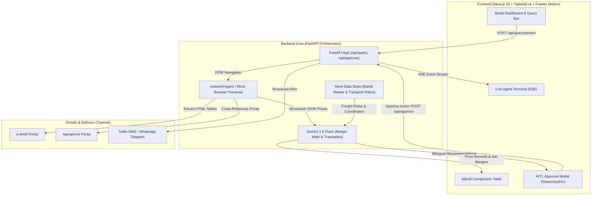
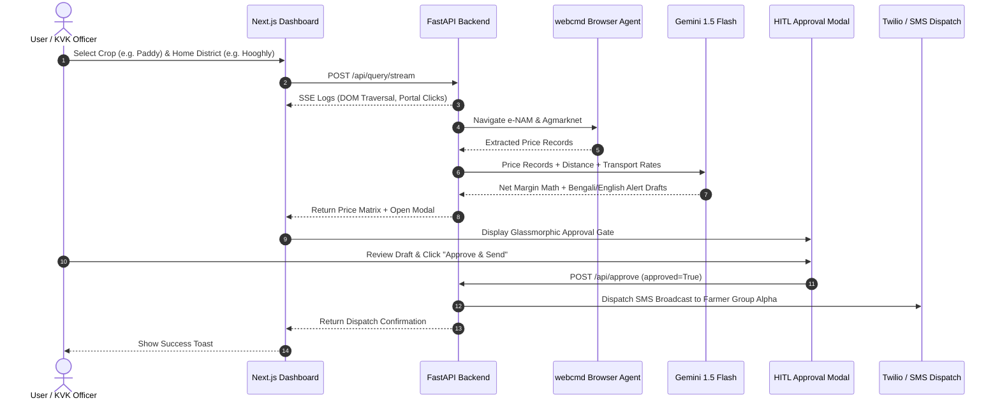

# MandiPulse AI 🌾 — Autonomous Agri-Arbitrage Agent

[](https://nextjs.org/)
[](https://fastapi.tiangolo.com/)
[](https://tailwindcss.com/)
[](https://www.framer.com/motion/)
[](https://www.python.org/)
[](LICENSE)

> **SLAB Hackathon & AgentForge 2026 @ GCELT, Kolkata**  
> *Bridging the real-time agricultural price discovery gap for smallholder farmers across India through autonomous browser agents, logistics-aware margin calculation, and bilingual localized alerts with non-negotiable Human-in-the-Loop guardrails.*

---

## 📖 Table of Contents

- [Executive Summary & Problem Statement](#-executive-summary--problem-statement)
- [Key Features](#-key-features)
- [System Architecture](#-system-architecture)
- [User Flow & Pipeline](#-user-flow--pipeline)
- [Tech Stack](#-tech-stack)
- [Project Structure](#-project-structure)
- [Getting Started](#-getting-started)
  - [Prerequisites](#prerequisites)
  - [Backend Setup (FastAPI)](#1-backend-setup-fastapi)
  - [Frontend Setup (Next.js)](#2-frontend-setup-nextjs)
- [API Reference & Data Contracts](#-api-reference--data-contracts)
- [Responsible AI & Guardrails](#-responsible-ai--guardrails)
- [Roadmap](#-roadmap)

---

## 🎯 Executive Summary & Problem Statement

Smallholder farmers in rural agricultural districts (e.g., Hooghly, Purba Bardhaman, Nadia) frequently sell crops at undervalued rates due to extreme local price asymmetry and dependence on middlemen. Although official government portals such as **e-NAM** and **Agmarknet** publish real-time price updates, these portals are burdened with:
1. Multi-step nested dropdowns and complex query interfaces.
2. Heavy DOM structures that perform poorly on low-bandwidth rural connections.
3. Lack of net profitability math: High mandi prices do not always yield higher profits when considering vehicle transport and fuel costs.

**MandiPulse AI** solves this by combining:
- **Autonomous Agent Traversal:** Automated browser scraping and path-cached navigation of agricultural portals.
- **Logistics-Adjusted Margin Math:** Real-time net profit calculation taking into account distance, vehicle types, and ₹/km/quintal freight rates.
- **Localized Bilingual Alerts:** LLM-generated recommendations in Bengali (বাংলা) and English.
- **Human-in-the-Loop (HITL) Safety Gate:** A mandatory glassmorphic approval modal ensuring no message is broadcast without human sign-off.

---

## ✨ Key Features

- 🖥️ **Bento Box Dashboard:** Sleek, responsive layout in a high-contrast **Agri-Tech Dark Mode** (slate-900 background with neon emerald accents).
- 🖱️ **Custom Glowing Cursor:** Smooth-tracking Framer Motion spring cursor that dynamically expands over clickable elements.
- ⚡ **Live Agent Terminal:** Real-time SSE (Server-Sent Events) streaming terminal simulating live webcmd agent navigation, DOM extraction, and LLM reasoning steps.
- 📊 **Mandi Price Matrix:** Visual comparison table highlighting top modal prices, ranges, transport costs, and net margin with trophy indicators.
- 🛡️ **Human-in-the-Loop (HITL) Modal:** Glassmorphic modal with background blur that halts the pipeline until an operator reviews the Bengali and English drafts and clicks "Approve & Send".
- 📱 **Simulated SMS / WhatsApp Dispatch:** Instant dispatch feedback via Twilio SMS / WhatsApp webhook simulation with real-time toast alerts.

---

## 🏗️ System Architecture



---

## 🔄 User Flow & Pipeline



---

## 🛠️ Tech Stack

| Layer | Technology | Purpose |
|---|---|---|
| **Frontend Framework** | **Next.js 16 (App Router)** | High-performance React framework with Turbopack |
| **Styling & Theme** | **Tailwind CSS v4 + Custom CSS** | Agri-Tech Dark Mode, Glassmorphism, Neon Emerald glow system |
| **Motion & Animations** | **Framer Motion** | Custom cursor tracking, fading hero titles, modal transitions |
| **Icons** | **Lucide React** | Consistent, lightweight SVG iconography |
| **Backend Framework** | **FastAPI (Python 3.11+)** | High-throughput async API, SSE streaming, Pydantic validation |
| **Browser Automation** | **`@agentrhq/webcmd`** | Headless browser agent with cached traversal paths |
| **AI / LLM** | **Google Gemini 1.5 Flash** | Structured JSON reasoning, logistics arithmetic & Bengali translation |
| **Alert Dispatch** | **Twilio SMS / Webhooks** | Outbound notification gateway for registered farmer groups |

---

## 📁 Project Structure

```
MundiPulse AI/
├── README.md                            # Comprehensive project documentation
├── MandiPulse_AI_PRD.md                 # Product Requirements Document
├── requirements.txt                     # Backend Python dependencies
├── .env.example                         # Environment variables template
│
├── backend/
│   ├── main.py                          # FastAPI application & route definitions
│   ├── config.py                        # Pydantic Settings & environment loader
│   ├── models/
│   │   ├── __init__.py
│   │   └── price_record.py              # Pydantic data schemas & contracts
│   ├── agent/
│   │   ├── __init__.py
│   │   ├── selectors/                   # DOM selector definitions for portals
│   │   └── cache/                       # Cached browser navigation paths
│   ├── llm/
│   │   └── __init__.py                  # Gemini LLM orchestration modules
│   └── services/
│       ├── __init__.py
│       ├── mock_agent.py                # Simulated webcmd scraping with WB mandi data
│       └── mock_gemini.py               # Margin math calculation & bilingual generation
│
├── frontend/
│   ├── app/
│   │   ├── globals.css                  # Agri-Tech Dark Theme design system
│   │   ├── layout.tsx                   # Font loading (Inter, JetBrains Mono) & metadata
│   │   ├── page.tsx                     # Main Bento Box Dashboard page
│   │   └── components/
│   │       ├── CustomCursor.tsx         # Framer Motion glowing spring cursor
│   │       ├── Hero.tsx                 # Fading title hero with rotating taglines
│   │       ├── QueryInput.tsx           # Commodity & District selection bar
│   │       ├── AgentTerminal.tsx        # Live SSE streaming log terminal
│   │       ├── PriceTable.tsx           # Mandi price comparison data table
│   │       ├── StatsCards.tsx           # Bento grid statistics cards
│   │       ├── ApprovalModal.tsx        # Glassmorphic Human-in-the-Loop modal
│   │       └── DispatchToast.tsx        # Alert dispatch confirmation toast
│   ├── package.json
│   ├── tsconfig.json
│   └── next.config.ts
│
├── data/
│   ├── mandi_master.json                # Master database of mandis, crops, coordinates
│   └── transport_rates.json             # Transport freight calculation parameters
│
├── docs/                                # Architecture diagrams & documentation
└── tests/                               # Test suite
```

---

## 🚀 Getting Started

### Prerequisites
- **Node.js**: v18.18+ or v20+
- **Python**: v3.10 or v3.11+
- **npm** or **pnpm** / **yarn**

---

### 1. Backend Setup (FastAPI)

1. Open a terminal in the project root:
   ```bash
   cd backend
   ```

2. Create and activate a Python virtual environment (optional but recommended):
   ```bash
   python -m venv venv
   # On Windows:
   .\venv\Scripts\activate
   # On Linux/macOS:
   source venv/bin/activate
   ```

3. Install required dependencies:
   ```bash
   pip install -r ../requirements.txt
   ```

4. Configure environment variables (optional for mock mode):
   ```bash
   cp ../.env.example ../.env
   ```

5. Start the FastAPI development server:
   ```bash
   python -m uvicorn main:app --reload --host 0.0.0.0 --port 8000
   ```
   *The backend will be running at `http://localhost:8000` (API documentation available at `http://localhost:8000/docs`).*

---

### 2. Frontend Setup (Next.js)

1. Open a new terminal in the `frontend` folder:
   ```bash
   cd frontend
   ```

2. Install dependencies:
   ```bash
   npm install
   ```

3. Start the Next.js development server:
   ```bash
   npm run dev
   ```
   *The dashboard will be live at `http://localhost:3000`.*

---

## 📡 API Reference & Data Contracts

### 1. Health Check
- **Endpoint:** `GET /api/health`
- **Response:**
  ```json
  {
    "status": "ok",
    "timestamp": "2026-08-20T18:46:52.233090+00:00"
  }
  ```

### 2. Stream Agent Query (SSE)
- **Endpoint:** `POST /api/query/stream`
- **Request Body:**
  ```json
  {
    "crop": "Paddy",
    "district": "Hooghly",
    "state": "West Bengal"
  }
  ```
- **SSE Event Types:**
  - `{"type": "system" | "agent" | "llm" | "success" | "error", "msg": "..."}`
  - `{"type": "result", "payload": { ... }}`

### 3. Human-in-the-Loop Approval Gate
- **Endpoint:** `POST /api/approve`
- **Request Body:**
  ```json
  {
    "run_id": "f998390d",
    "approved": true,
    "approved_by": "organizer",
    "edited_message": null
  }
  ```
- **Response:**
  ```json
  {
    "status": "approved_and_dispatched",
    "run_id": "f998390d",
    "dispatch": {
      "channel": "twilio_sms",
      "recipient_group": "Farmer Group Alpha",
      "dispatched_at": "2026-08-20T18:49:10Z",
      "delivery_status": "delivered"
    }
  }
  ```

---

## 🛡️ Responsible AI & Guardrails

1. **Non-Negotiable HITL Approval:** Autonomous agents draft and format price alerts, but outbound dispatch is strictly blocked until an authorized human operator clicks "Approve".
2. **Data Transparency & Provenance:** Every price row visibly attributes its source portal (`e-NAM`, `Agmarknet`, `APMC`) and timestamp.
3. **Price Fluctuation Disclaimers:** All drafted bilingual SMS copy embeds cautionary notices advising farmers that prices fluctuate dynamically throughout trading hours.
4. **Transport Realism:** Recommends alternative mandis *only* when the price differential strictly exceeds logistics freight expenses.

---

## 🗺️ Roadmap

- [x] Modern Next.js 16 + Tailwind v4 + Framer Motion Bento Dashboard.
- [x] Custom glowing cursor with interactive states.
- [x] Live Server-Sent Events (SSE) Agent Terminal.
- [x] Human-in-the-Loop Glassmorphic Approval Gate.
- [x] Bengali + English bilingual translation engine.
- [ ] Integration with live `@agentrhq/webcmd` browser CLI.
- [ ] Direct Twilio API and WhatsApp Cloud API live dispatch.
- [ ] Voice-based IVR alerts for non-literate farmers.
- [ ] Historical 7-day commodity price trend visualization.

---

## 👥 Contributors & Event

Built for **SLAB Hackathon & AgentForge 2026** at Government College of Engineering and Leather Technology (GCELT), Kolkata.

*Released under the [MIT License](LICENSE).*
